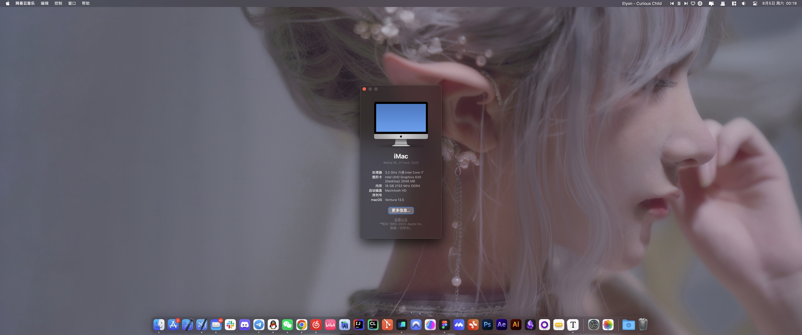
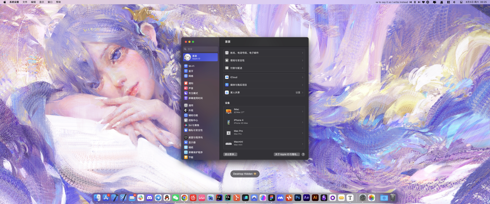
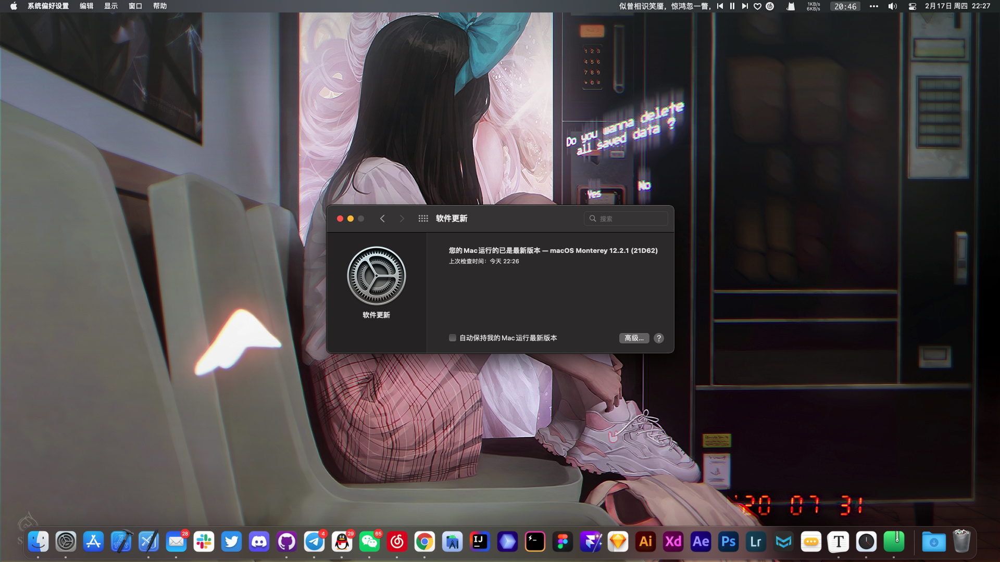

# Hackintosh

Hackintosh OpenCore EFI for **macOS Ventura** (and below) for ***Z370***.

## Information

> **Almost all system functions & modules work for me.**

- **macOS:** [**Ventura**](ventura/) / [**Monterey**](monterey/) / [**BigSur**](big-sur/)
- **Motherboard:**  [**ASUS PRIME Z370-P II**](https://motherboarddb.com/motherboards/426/)
- **CPU:** Intel(R) Core(TM) **i7-8700** CPU
- **iGPU:** Intel UHD Graphics **630** (**Desktop**)
- **dGPU:** Unsupported **NVIDIA**, **disabled**
- **NVMe:** ✅
- **Audio:** ✅
- **Bluetooth:** ✅
- **Sleep:** ✅ *but need to press the power button to wake up*
- **USB:** ✅ *but you may need to customize your own ([USBTool](https://github.com/USBToolBox/tool))*

## Ventura

## Monterey

## Credits

- [OpenCore](https://github.com/acidanthera/OpenCorePkg): Makes everything possible.
- [OpenCore-Post-Install](https://github.com/dortania/OpenCore-Post-Install): The starting point of everything for me.
- [Acidanthera](https://github.com/acidanthera?type=source): Provides kernel extensions for almost any device.
