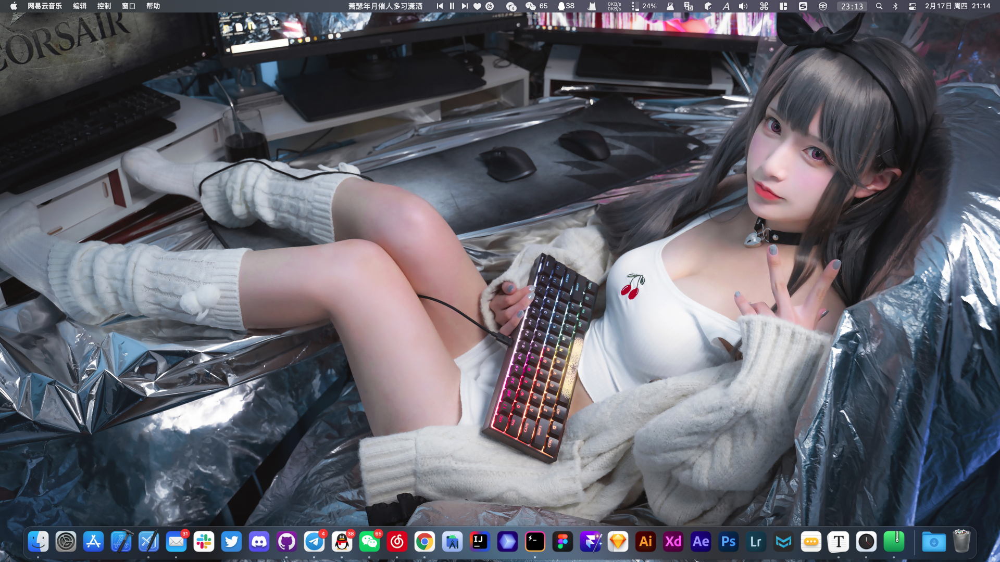

# Hackintosh

 Hackintosh OpenCore EFI for **macOS Monterey** (or below) for [*ASUS Prime Z370-P II*](https://www.asus.com/Motherboards-Components/Motherboards/PRIME/PRIME-Z370-P-II/)

------

> **Almost all system functions & modules work for me.**

## Credits

- [OpenCore](https://github.com/acidanthera/OpenCorePkg): Makes everything possible.
- [OpenCore-Post-Install](https://github.com/dortania/OpenCore-Post-Install): The starting point of everything for me.
- [Acidanthera](https://github.com/acidanthera?type=source): Provides kernel extensions for almost any device.
